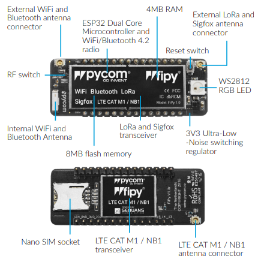
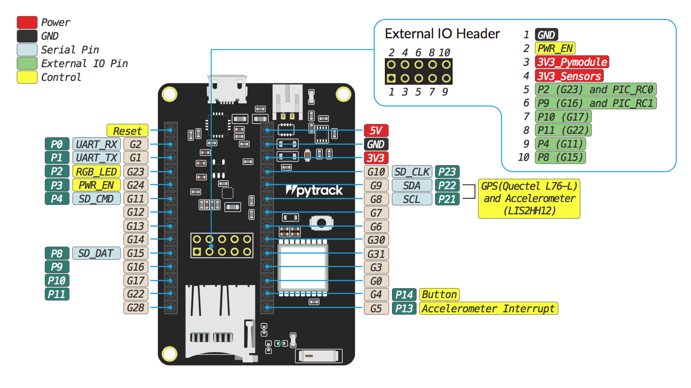
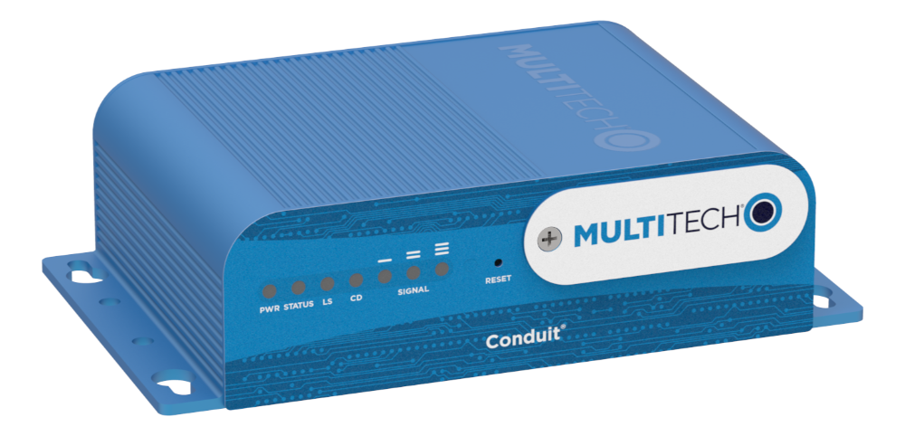
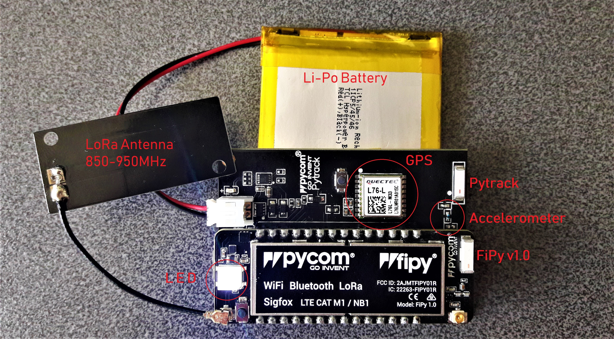

<a href="https://github.com/mcagriaksoy/fipy-GPS-Accelerometer-LoRa" title="Go to GitHub repo"></a>
<a href="https://github.com/mcagriaksoy/fipy-GPS-Accelerometer-LoRa/releases/"></a>
<a href="#license"></a>
<a href="https://github.com/mcagriaksoy/fipy-GPS-Accelerometer-LoRa/issues"></a>
[](https://www.linux.org/ "Go to Linux homepage")
[](https://pages.github.com/ "Go to GitHub Pages homepage")
[](https://www.microsoft.com/ "Go to Microsoft homepage")

## Abstract

Read GPS and Accelerometer values and push them to the remote server via LoRa protocol.

## Hardware

FiPy 1.0 with Espressif ESP32



More information at: https://pycom.io/wp-content/uploads/2018/08/fipySpecsheetAugust2017n2-1.pdf

PyTrack Shield to connect FiPy board:


More information at: https://docs.pycom.io/datasheets/expansionboards/pytrack/

"Multitech Conduit Gateway" as LoRa Gateway


More information at: https://www.multitech.com/brands/multiconnect-conduit

## Introduction

In this project, I pay attention to consume low power and stability. To decrease power consumption I used Cayenne LPP, Accelerometer sleep - wake up modes and close the unnecessary functions of FiPY.
Network:
TTN(The things network)
https://www.thethingsnetwork.org/

-No payload decoder is required for this project because I used the cayenneLPP library. If I had used other scenarios, I would have required decode my message with the payload decoder tab in the TTN.

## Dependency installition

Pytrack:
`python3 -m pip install PyTrack-NTU`

PyCom board information:
`python3 -m pip install pycom`

## Usage:

In this project, micropython is used for esp32.
More information regarding micro python:

https://github.com/micropython/micropython

https://docs.micropython.org/en/latest/reference/packages.html

CayenneLPP is using to send the data to the TTN network. It is easy because just one click is enough for the decode hex code thanks to cayenneLPP.
Just select the option Payload Formats>>Cayenne and decode automatically.
Also In python side, we need to add these functions into the code block:

```
lpp.add_accelerometer(xsum,ysum,zsum)

lpp.add_analog_input(abs(gtotal-1))

lpp.add_analog_input(volt, channel = 114)

lpp.add_gps(c0, c1, 55)

lpp.send()
```


On the other hand we need to set the settings of LoRa:

```
lora = LoRa(mode=LoRa.LORAWAN, region=LoRa.EU868,adr=False, tx_retries=0, device_class=LoRa.CLASS_A)

-Required keys can be found on TTN network >> Applications >> Dashboard

dev_addr = struct.unpack(">l", binascii.unhexlify('********'))[0]

nwk_swkey = binascii.unhexlify('***************')

app_swkey = binascii.unhexlify('****************')

lora.join(activation=LoRa.ABP, auth=(dev_addr, nwk_swkey, app_swkey))

s = socket.socket(socket.AF_LORA, socket.SOCK_RAW)

s.setsockopt(socket.SOL_LORA, socket.SO_DR, 0)

print ("LoRa Initialized")
```



# Cite

If you like this project, please star and cite `:)`
